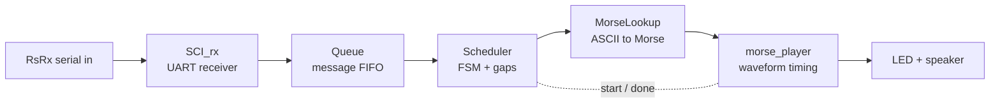

# Morse Code Converter

ENGS 31 Final Project — a hardware Morse code converter for the Digilent **Basys3** (Artix-7) FPGA.

Characters typed into a serial terminal are received over UART, queued, encoded into
Morse, and played back as timed blinks on an LED and a 600 Hz tone on a speaker output.

**Contributors:** Papa Yaw Owusu Nti, Gent Maksutaj

---

## How It Works

Bytes flow through the design one stage at a time:



- **`SCI_rx`** — UART receiver; turns the serial line into 8-bit bytes (9600 8N1).
- **`queue`** — 8-deep FIFO that buffers received characters.
- **`scheduler`** — FSM that reads the FIFO, classifies spaces vs. symbols, and inserts the correct letter (3T) and word (7T) gaps.
- **`morse_lookup`** — ROM mapping each ASCII byte to its 19-bit Morse pattern and length.
- **`morse_player`** — streams the pattern one T-unit at a time, driving `morse_on`.
- **`tick_gen`** — parameterizable tick/clock-enable generator off the single 100 MHz clock; one instance makes the Morse T-unit timebase, another the 600 Hz tone.
- **`morse_code_converter`** — top level that wires it all together.

Timing is set by generics in `morse_code_converter.vhd` (defaults: 9600 baud, 100 ms dot ≈ 12 WPM, 600 Hz tone).

---

## Repository Layout

```
.
├── build.sh / build.tcl                # project generation scripts
├── constraints/morse_code_constraints.xdc
└── src
    ├── morse_code_converter.vhd        # top level
    ├── subs/                           # submodules (SCI_rx, queue, scheduler, ...)
    └── tb/                             # testbenches
```

---

## Build the Project

You need Xilinx **Vivado** installed. The `build.tcl` script generates the Vivado
project (`build/morse_code_converter/morse_code_converter.xpr`) from source.

```bash
git clone https://github.com/gentmaks/Morse-Code-Converter.git
cd Morse-Code-Converter
```

**Windows (Vivado Tcl Shell):**

```tcl
source build.tcl
start_gui
```

**macOS / Linux (Vivado on PATH):**

```bash
./build.sh
```

> Run the script from the repo root — it uses relative paths to find the sources.

Then take the project through **Synthesis → Implementation → Generate Bitstream**
(from the GUI, or with `launch_runs synth_1` / `impl_1 -to_step write_bitstream`).

---

## Program and Run

1. Connect the Basys3 to your computer with the **micro-USB (PROG/UART)** cable and power it on.
2. In Vivado, open **Hardware Manager → Open Target → Auto Connect → Program Device** and load the bitstream.
3. Open a serial terminal on the port the board enumerates as, configured **9600 baud, 8 data bits, no parity, 1 stop bit, no flow control**:
   - **Windows:** PuTTY → Serial, line `COMx`, speed `9600`.
   - **macOS/Linux:** `tio -b 9600 /dev/cu.usbserial-XXXX` or `screen /dev/cu.usbserial-XXXX 9600`.
4. **Type characters.** Each keystroke is sent immediately (no Enter needed) and played out as Morse on the LED and speaker.

Try `E` (one dot), `T` (one dash), or `SOS`. Spaces produce the longer word gap.

---

## Pin Mapping (Basys3)

| Top-level port      | Pin  | Board function          |
|---------------------|------|-------------------------|
| `clk_ext_port`      | W5   | 100 MHz clock           |
| `RsRx_ext_port`     | B18  | USB-UART receive        |
| `reset_ext_port`    | U18  | Center button (reset)   |
| `led_ext_port`      | U16  | LED0 (Morse output)     |
| `speaker_ext_port`  | J1   | Pmod JA1 (gated tone)   |

For audio, connect a passive piezo buzzer between **JA1 and GND**, or feed JA1 into a
Pmod AMP2 to use a headphone jack.

---

## Simulation

Each module has a self-contained testbench in `src/tb/`. In Vivado, set the desired
testbench as the simulation top and run a behavioral simulation, e.g.:

```tcl
set_property top SCI_rx_tb [get_filesets sim_1]
launch_simulation
```

The testbenches override the timing generics with small values so a full character
plays in microseconds rather than real time.


## Demo

